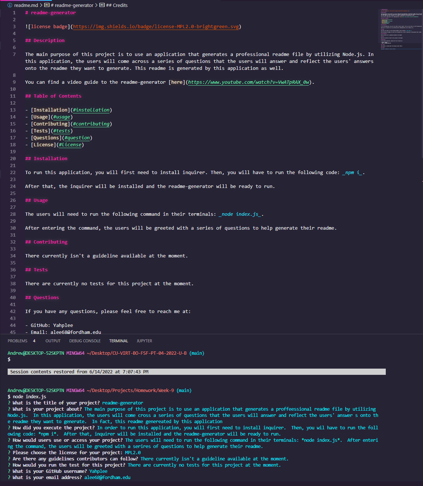

# readme-generator

## Description

The main purpose of this project is to use an application that generates a professional readme file by utilizing Node.js. In this application, the users will come across a series of questions that the users will answer and reflect the users' answers onto the readme they want to generate. This readme is generated by this application as well.

You can find a video guide to the readme-generator [here](https://youtu.be/LiWKNOVKcls).

## Table of Contents

- [Installation](#installation)
- [Usage](#usage)
- [Contributing](#contributing)
- [Tests](#tests)
- [Questions](#question)
- [License](#license)

## Installation

To run this application, you will first need to install inquirer after cloning this repository. Then, you will have to run the following code: _npm i_.

After that, the inquirer will be installed and the readme-generator will be ready to run.

## Usage

The users will need to run the following command in their terminals: _node index.js_.

After entering the command, the users will be greeted with a series of questions to help generate their readme.

Please find a screenshot of the application at work and the result!

## Contributing

There currently isn't a guideline available at the moment.

## Tests

There are currently no tests for this project at the moment.

## Questions

If you have any questions, please feel free to reach me at:

- GitHub: Yahplee
- Email: alee68@fordham.edu

## License

This project is nested under the following license: MPL2.0

## Credits

Copyright © Yahplee All rights reserved.
